# Windsurfer - Windsurfing Training Log App

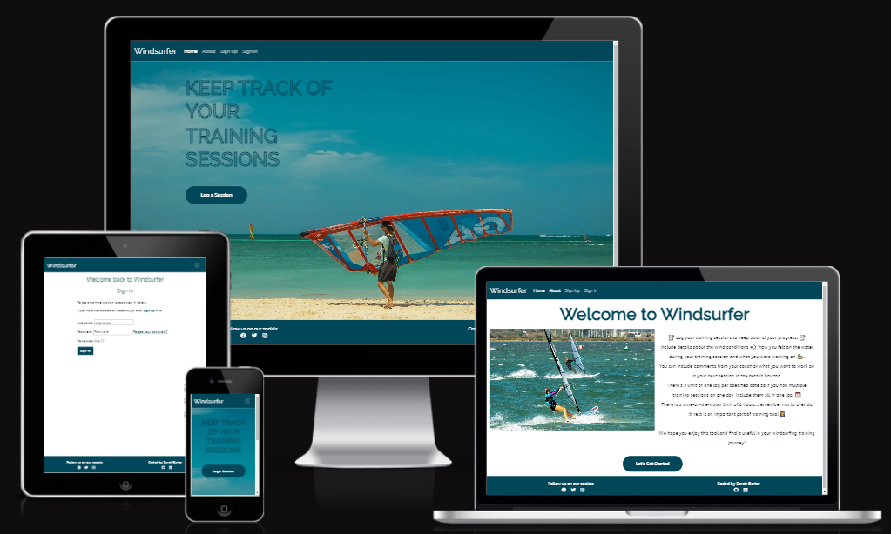

## The Purpose of the Project

Most wearable tech devices have features to record various sporting activities - running, cycling, yoga etc. However, there is no feature to record watersports sessions, apart from swimming. This app is designed to be used by windsurfers to log their training sessions which will allow them to track their progress on the water.

## User Stories

- Home page: As a visiting user, I want be able to see a navigation bar with links to the various pages of the site. And I want to be directed to the sign in page quickly and easily.
- About page: As a visiting user, I want to learn more about the app and it's purpose. And then be redirected to the sign up page quickly and easily.
- Sign Up page: As a visiting user, I want to be able to fill in a sign up form quickly and easily, and receive confirmation that I have been successfully signed up.
- Sign In page: As a visiting user, I want to be able to sign into the app quickly and easily, and receive confirmation that I have been successfully signed in.
- My Sessions page: As a visiting user, I want to see a list of all the sessions I have logged so far and be able to log a new session quickly and easily.
- Create Session page: As a visiting user, I want to be able to fill in a form with all the details about my training session. I want to receive confirmation that my session has been logged successfully.
- Session Detail page: As a visiting user, I want to be able to see the details I have logged about a particular training session.
- Edit Session page: As a visiting user, I want to be able to fill in a form that will update any or all elements of a particular training session. And receive confirmation that my session has been updated successfully.
- Delete Session page: As a visiting user, I want to able to confirm that I want to delete the selected training session. And I want to receive confirmation that the session has been deleted successfully.
- Log Out page: As a visiting user, I want to be able to log out of my profile and return to the home page. And receive confirmation that I have been signed out successfully.

- Django Admin access: As admin of the app, I want to be able to access the admin page and edit/delete a particular session and edit/delete a user and their logged sessions.

## Features

- Nav bar - for non-authenticated users and for authenticated users
  The app displays a nav-bar across all pages of the site. Prior to signing in, the user can see links to the home page, the about page, the sign in page and the sign up page.

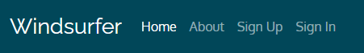

After signing in, the user will see a link to the My Sessions which is a list of their logged sessions, and a link to sign out.

- Log a session button - the user can see a button inviting them to log a session. The user will be redirected to sign in, if they haven't already done so. Otherwise they will be directed to their list of sessions.

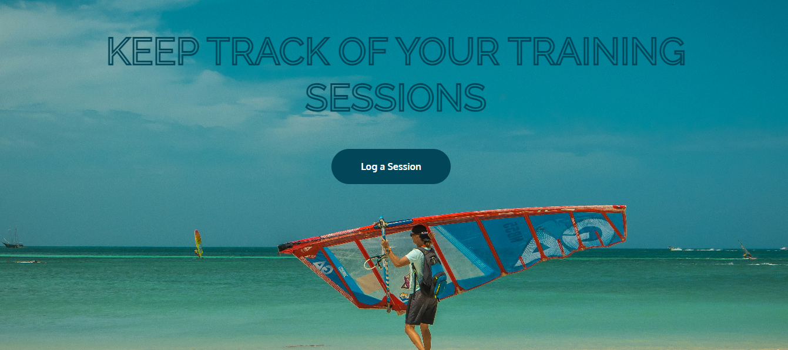

- Footer - The app displays the same footer across all pages of the site. The user can see links to social media sites and the developers GitHub and LinkedIn profiles.

- Description of the app and link to sign up - the user can learn about how the app functions and then navigate to the sign up form.

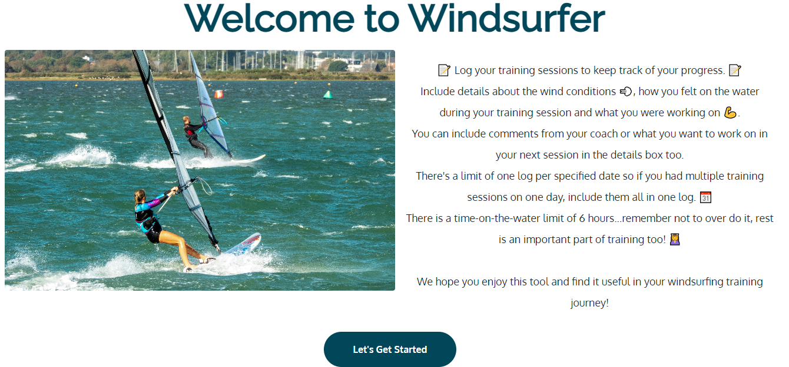

- Sign up form - The user can fill in their personal details to create a profile on the app.

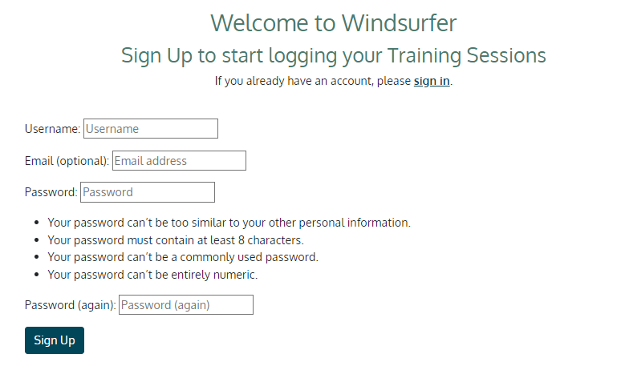

- Sign in form - The user can fill in their username and password and be signed into their profile.

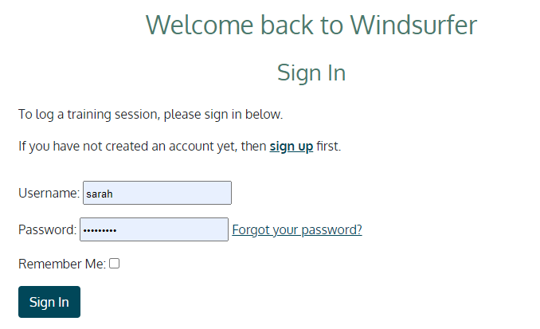

- Sessions list - The user can view their logged sessions list and click a button to log another session. A maximum of 5 sessions will be logged per page.

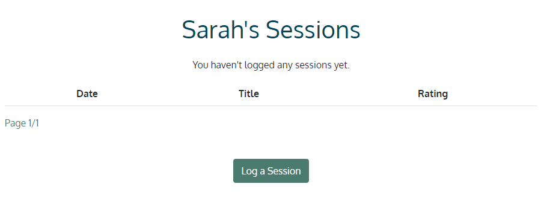

- Create session form - The user can fill in a form with all the details of their training session including what they did, how the wind was and how they would rate their time on the water.

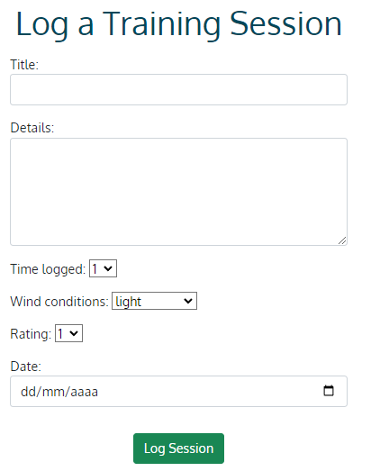

- Session detail - The user can click the session they want to view and the see the details they've logged.

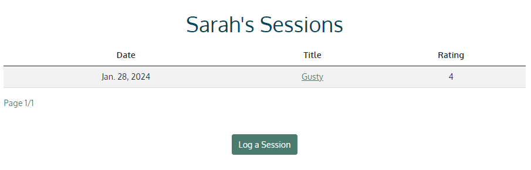
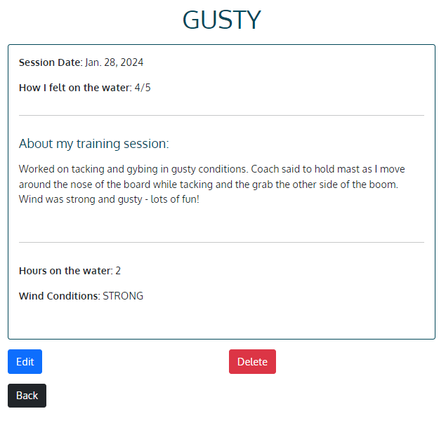

- Edit Session form - The user can easily update any section of the session's details.

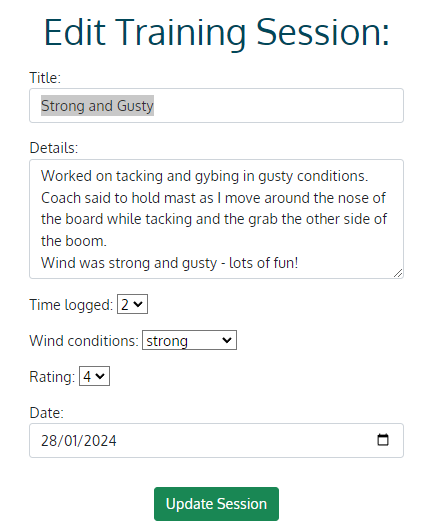

- Delete session confirmation button - The user can either confirm they want to delete a session or cancel the deletion process.

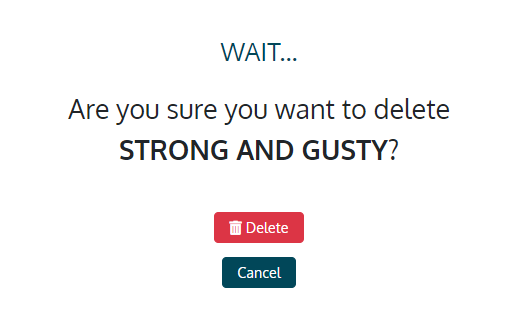

- Sign out button - The user can confirm that they want to be signed out of the profile.

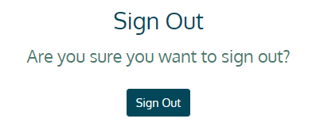

- Success Messages - The user will see success messages on Siging up/in/out and on creating, updating and deleting a session log.
  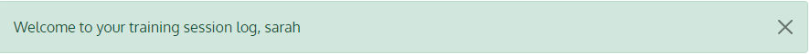
  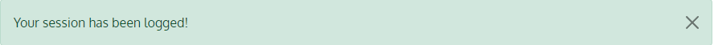
  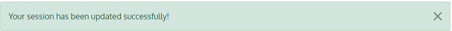
  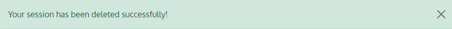
  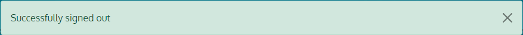

## Future Features

- Total Hours Tally - I would like to have a tally of all the training hours logged by the user displayed on their personal My Sessions page. This would further add to the purpose of the app and benefit the user in their windsurfing training journey.

- A map of locations - I would like to add a page to the site with a Google map of locations where there are decent windsurfing conditions.

- A location suggestion form - I would also like to add an input feature where an app user can send a location suggestion to the app owner to review and then add to the map of locations. This would make the app a community-led site and further encourage windsurfing training sessions.

- Change password feature - I would like to implement an option for the user to update or change their password if they have forgotten it. Currently there is a link that takes the user to a page informing them to contact the app's support team to change their password. A feature allowing the user to do this themselves would be more user friendly and in line with standard authentication features.

## Typography and Color Scheme

Google Fonts:

- 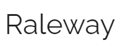 For logo and headline
- 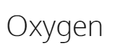 For all other text

Colour palette generated by [Coolers](https://www.coolers.co), using colours from the hero image on the Home page.

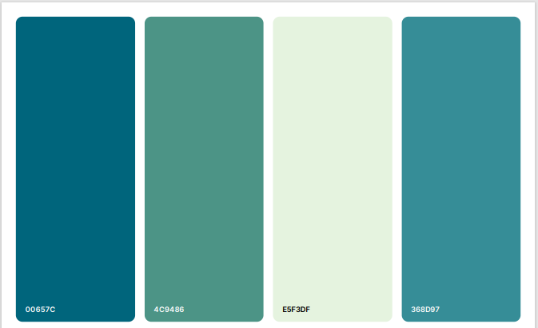

## Wireframes

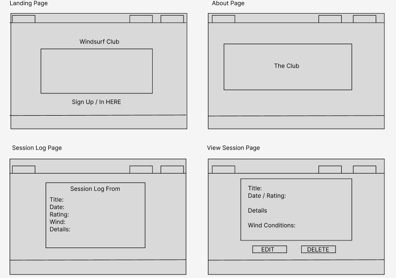

## ERD

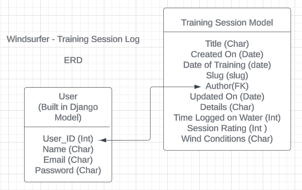

##### User Model:

Django built-in model for authentication purposes
Fields:

- user_id (primary key)
- username
- email (optional)
- password

##### Session Model:

Custom model for the purpose of this project
Fields:

- Title
- Created On (date field)
- Date of Training (a unique field for when the training session happened)
- Slug
- Author(foreign key linking to the User model)
- Updated On (date field)
- Details (User can add details about their training session e.g what they were learning/working on, comments from the coach, goals for the next session)
- Time Logged on the Water (maximum of 6 hours)
- Session Rating (out of 5, to rate how the user felt on the water during the session)
- Wind Conditions (user selects how they would describe the wind during their session)

## Technology

#### Languages

- Python
- HTML
- CSS
- JavaScript

#### Frameworks

- Django and Django libraries: allauth, active link, autoslug, crispy forms, summernote
- Bootstrap - for responsive styling

#### Database

- ElephantSQL - a PostgreSQL database as a service

#### Other

- Cloudinary - for image storage
- Heroku - to deploy the site
- Git - version control
- GitHub - to host the project repo. Also used GitHub's Agile Project Board feature to plan the development of the project.

## Testing

Follow this [link](TESTING.md) to the testing results page.

## Deployment

#### Fork the repository on GitHub

- On the Windsurfer GitHub Repository page, click "Fork" in the top right of the page. A forked version of the project will appear.

- Next Clone the forked repository by clicking the green "<> Code" button. Copy the URL and load it into your preferred IDE to set up the local environment and connect it with the GitHub repo.

#### Deploy on Heroku

- When the forked repo of the projec is read to be deployed, create a Pipfile.
- In the terminal enter the command "pip3 freeze > requirements.txt". A file with all the requirements for the app will be created.

##### Setting up Heroku

- Navigate to the [Heroku](https://www.heroku.com/) website
- Login to Heroku and click on "Create App"
- Click "New" and "Create a new app"
- Choose a name and select your location
- Navigate to the Resources tab
- From the Resources list select "Heroku Postgres"
- Navigate to the "Deploy" tab
- Click on "Connect to Github" and search for your repository
- Navigate to the Settings tab
- Reveal Config Vars and add your Cloudinary and Database URL (from Heroku-Postgres) and Secret key.

#### Deploy on Heroku

- Navigate to the Deploy tab.
- Choose the main branch for deploying and enable automatic deployment
- Select manual deploy to build the App for the first time and check your build log for any issues

## Credits

#### For Roadblock Solutions and Explanations

- [Add date to slug](https://stackoverflow.com/questions/62532910/add-a-date-or-a-number-at-the-end-of-a-slug)
- [Pagination](https://docs.djangoproject.com/en/5.0/topics/pagination/)
- [Generic display](https://docs.djangoproject.com/en/5.0/topics/class-based-views/generic-display/)
- [Datefield - only past dates](https://stackoverflow.com/questions/4941974/django-how-to-set-datefield-to-only-accept-today-future-dates)
- [Future date validator](https://stackoverflow.com/questions/50002600/django-models-datefield-prevent-past)
- [Limit dates with django widget](https://stackoverflow.com/questions/61031491/can-i-limit-the-dates-possibilities-using-django-widget-dateinput-ex-between-2)
- [Delete success message](https://stackoverflow.com/questions/24822509/success-message-in-deleteview-not-shown)
- [Text-stroke styling](https://codepen.io/bramus/pen/rLovLY)
- [Disable submit button onclick](https://www.codeproject.com/Questions/5311757/Disable-the-submit-button-after-click-while-waitin)

#### CI Walk-through projects and other PP4s for examples/inspiration on structure

- CI Hello Django, I think therefore I blog - video tutorials
- Kim Bergstroem - [PP4](https://github.com/KimBergstroem/PP4/tree/main)
- Christian Goran - [Dome Restaurant](https://github.com/christiangoran/dome-restaurant-repo/tree/main)

#### Media

- [Unsplash](https://unsplash.com) - for open-source images by [Darice de Cuba](https://unsplash.com/@darice?utm_content=creditCopyText&utm_medium=referral&utm_source=unsplash) and [Nick Fewings](https://unsplash.com/@jannerboy62?utm_content=creditCopyText&utm_medium=referral&utm_source=unsplash)
- [LucidCharts](https://www.lucidchart.com) for the ERD
- [Figma](https://www.figma.com/) for the wireframes
- [Coolers](https://www.coolers.co) for the color palette
- [Favicon](https://favicon.io/) to generate the app's favicon
