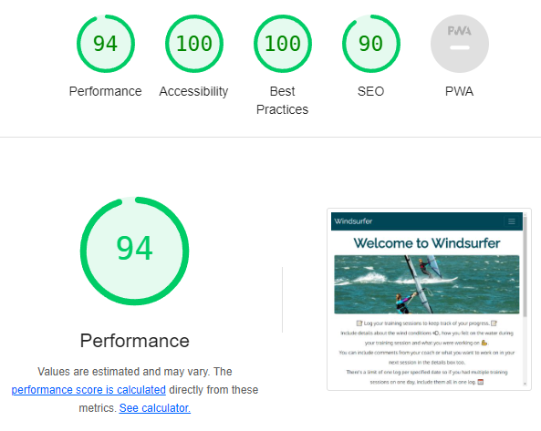

# Windsurfer - Training Session Log App - Testing

## Code Validation

### HTML

The pages were tested with https://validator.w3.org/nu/ - using the "address" feature, and the "text-input" feature to test pages that have user authentication blocking general access.

|       Tested        |                                                                                      Result                                                                                       | View                                                                                                           | Passed |
| :-----------------: | :-------------------------------------------------------------------------------------------------------------------------------------------------------------------------------: | -------------------------------------------------------------------------------------------------------------- | ------ |
|     index.html      |                 No errors. Warning about "lang" in <head> - has been resolved. Info messages about trailing "/" which are present due to the local IDE settings.                  | 
 
View result
  
      | ✔      |
|     about.html      |                                                                                     No errors                                                                                     | 
 
View result
  
      | ✔      |
|     signup.html     |                                                   4 errors detected but they are false errors due to Django template variables                                                    | 
 
View result
  
     | ✔      |
|  my_sessions.html   | Using code from "Source Code" option on right clicking the page - no errors found. Avoids issues arising when testing the page address due to Django authentication requirements. | 
 
View result
  
 | ✔      |
|     login.html      |                                                Using code from "Source Code" option on right clicking the page - no errors found.                                                 | 
 
View result
  
      | ✔      |
|     logout.html     |                                                Using code from "Source Code" option on right clicking the page - no errors found.                                                 | 
 
View result
  
     | ✔      |
| create_session.html |                                                Using code from "Source Code" option on right clicking the page - no errors found.                                                 | 
 
View result
  
     | ✔      |
| session_detail.html |                                                Using code from "Source Code" option on right clicking the page - no errors found.                                                 | 
 
View result
  
       | ✔      |
| update_session.html |                                                Using code from "Source Code" option on right clicking the page - no errors found.                                                 | 
 
View result
  
     | ✔      |
| delete_session.html |                                                Using code from "Source Code" option on right clicking the page - no errors found.                                                 | 
 
View result
  
     | ✔      |

### CSS

The app was tested with https://jigsaw.w3.org/css-validator.

| Tested         | Result    | View Result                                                                                                 | Pass |
| -------------- | --------- | ----------------------------------------------------------------------------------------------------------- | ---- |
| CSS file       | No errors | 
 
View result
  
     | ✔    |
| Entire webpage | No errors | 
 
View result
  
 | ✔    |

### Python - PEP8

The app was tested with https://pep8ci.herokuapp.com/

| Tested                 | Result    | View Result                                                                                                             | Pass |
| ---------------------- | --------- | ----------------------------------------------------------------------------------------------------------------------- | ---- |
| windsurfer/settings.py | No errors | 
 
View result
  
 | ✔    |
| windsurfer/urls.py     | No errors | 
 
View result
  
     | ✔    |
| session_log/models.py  | No errors | 
 
View result
  
  | ✔    |
| session_log/views.py   | No errors | 
 
View result
  
   | ✔    |
| session_log/forms.py   | No errors | 
 
View result
  
   | ✔    |
| session_log/urls.py    | No errors | 
 
View result
  
    | ✔    |

## Accessibility

### Wave

The app was tested with https://wave.webaim.org/ - no errors or contrast warnings were detected.

 
View result
  

## Performance

### Lighthouse

The app was tested with Google Chrome's Lighthouse tool to analyse performance. It was tested in incognito mode.

| Tested              | Performance Score | View Result                                                                                                            |
| ------------------- | ----------------- | ---------------------------------------------------------------------------------------------------------------------- |
| index.html          | 94                | 
 
View result
  
       |
| about.html          | 94                | 
 
View result
  
      |
| signup.hmtl         | 95                | 
 
View result
  
     |
| login.html          | 93                | 
 
View result
  
      |
| logout.html         | 96                | 
 
View result
  
     |
| create_session.html | 94                | 
 
View result
  
     |
| my_sessions.html    | 95                | 
 
View result
  
 |
| session_detail.html | 95                | 
 
View result
  
       |
| update_session.html | 94                | 
 
View result
  
     |
| delete_session.html | 92                | 
 
View result
  
     |

## Test Cases (user story based with screenshots)

## Fixed Bugs

- On clicking the 'create session'/'update session'/'delete session' buttons in quick succession, multiple sessions were logged, updated and tried to be deleted. Put block on buttons once they've been clicked.
- Delete Success Message wasn't displaying - found tutorial on how to create a Delete Message

## Supported Screens and Browsers

- Using the Google Chrome Simulateur-Mobile extension, the app was tested on the following devices:

  - Samsung Galaxy Fold
  - Xiaomi 12
  - iPhone X
  - iPad Air 4 (showed issues with responsiveness of the main image on index.html)
  - MacBook Air

- The app was tested on the following browsers:

  - Safari
  - Chrome
  - Firefox
  - Edge
