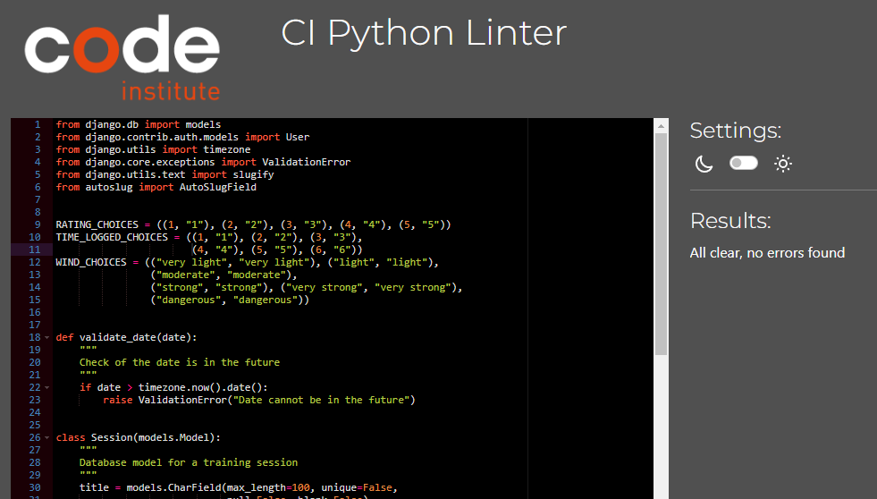

# Windsurfer - Training Session Log App - Testing

## Code Validation

### HTML

The pages were tested with https://validator.w3.org/nu/ - using the "address" feature, and the "text-input" feature to test pages that have user authentication blocking general access.

|       Tested        |                                                                                      Result                                                                                       | View                                                                                                           | Passed |
| :-----------------: | :-------------------------------------------------------------------------------------------------------------------------------------------------------------------------------: | -------------------------------------------------------------------------------------------------------------- | ------ |
|     index.html      |                 No errors. Warning about "lang" in <head> - has been resolved. Info messages about trailing "/" which are present due to the local IDE settings.                  | 
 
View result
  
      | ✔      |
|     about.html      |                                                                                     No errors                                                                                     | 
 
View result
  
      | ✔      |
|     signup.html     |                                                   4 errors detected but they are false errors due to Django template variables                                                    | 
 
View result
  
     | ✔      |
|  my_sessions.html   | Using code from "Source Code" option on right clicking the page - no errors found. Avoids issues arising when testing the page address due to Django authentication requirements. | 
 
View result
  
 | ✔      |
|     login.html      |                                                Using code from "Source Code" option on right clicking the page - no errors found.                                                 | 
 
View result
  
      | ✔      |
|     logout.html     |                                                Using code from "Source Code" option on right clicking the page - no errors found.                                                 | 
 
View result
  
     | ✔      |
| create_session.html |                                                Using code from "Source Code" option on right clicking the page - no errors found.                                                 | 
 
View result
  
     | ✔      |
| session_detail.html |                                                Using code from "Source Code" option on right clicking the page - no errors found.                                                 | 
 
View result
  
       | ✔      |
| update_session.html |                                                Using code from "Source Code" option on right clicking the page - no errors found.                                                 | 
 
View result
  
     | ✔      |
| delete_session.html |                                                Using code from "Source Code" option on right clicking the page - no errors found.                                                 | 
 
View result
  
     | ✔      |

### CSS

The app was tested with https://jigsaw.w3.org/css-validator.

| Tested         | Result    | View Result                                                                                                 | Pass |
| -------------- | --------- | ----------------------------------------------------------------------------------------------------------- | ---- |
| CSS file       | No errors | 
 
View result
  
     | ✔    |
| Entire webpage | No errors | 
 
View result
  
 | ✔    |

### Python - PEP8

The app was tested with https://pep8ci.herokuapp.com/

| Tested                 | Result    | View Result                                                                                                             | Pass |
| ---------------------- | --------- | ----------------------------------------------------------------------------------------------------------------------- | ---- |
| windsurfer/settings.py | No errors | 
 
View result
  
 | ✔    |
| windsurfer/urls.py     | No errors | 
 
View result
  
     | ✔    |
| session_log/models.py  | No errors | 
 
View result
  
  | ✔    |
| session_log/views.py   | No errors | 
 
View result
  
   | ✔    |
| session_log/forms.py   | No errors | 
 
View result
  
   | ✔    |
| session_log/urls.py    | No errors | 
 
View result
  
    | ✔    |

## Accessibility

### Wave

The app was tested with https://wave.webaim.org/ - no errors or contrast warnings were detected.

 
View result
  

## Performance

### Lighthouse

The app was tested with Google Chrome's Lighthouse tool to analyse performance. It was tested in incognito mode.

| Tested              | Performance Score | View Result                                                                                                            |
| ------------------- | ----------------- | ---------------------------------------------------------------------------------------------------------------------- |
| index.html          | 94                | 
 
View result
  
       |
| about.html          | 94                | 
 
View result
  
      |
| signup.hmtl         | 95                | 
 
View result
  
     |
| login.html          | 93                | 
 
View result
  
      |
| logout.html         | 96                | 
 
View result
  
     |
| create_session.html | 94                | 
 
View result
  
     |
| my_sessions.html    | 95                | 
 
View result
  
 |
| session_detail.html | 95                | 
 
View result
  
       |
| update_session.html | 94                | 
 
View result
  
     |
| delete_session.html | 92                | 
 
View result
  
     |

## Manual Testing

### Test Cases

| User Story                                                                                                                                                                                                                | Test Approach Summary                                                                                                                                                                                                                                                                                                                                                                                                                                                                                                                                                                                                                                                                                                                                          | Results                                                                                                                                                                                                                                                                               |
| ------------------------------------------------------------------------------------------------------------------------------------------------------------------------------------------------------------------------- | -------------------------------------------------------------------------------------------------------------------------------------------------------------------------------------------------------------------------------------------------------------------------------------------------------------------------------------------------------------------------------------------------------------------------------------------------------------------------------------------------------------------------------------------------------------------------------------------------------------------------------------------------------------------------------------------------------------------------------------------------------------- | ------------------------------------------------------------------------------------------------------------------------------------------------------------------------------------------------------------------------------------------------------------------------------------- |
| Home page: As a visiting user, I want be able to see a navigation bar with links to the various pages of the site. And I want to be directed to the sign in page quickly and easily.                                      | On Home page load - nav bar is clearly visible. On small screen devices hamburger icon appears. This is visible on all pages of the app. Windsurfer logo - links to the home page. Other nav bar items link to their corresponding pages. Log a session button - links to sign-in page to make access easier for returning users. If the user is signed in, the button links to the user's My Sessions page. Footer - visible on all pages of the app. Links to usual social media sites open in a new tab. Links to developers professional sites open in a new tab.                                                                                                                                                                                          | All links function correctly. 

View Results

                                                                                                                                                                                          |
| About page: As a visiting user, I want to learn more about the app and it's purpose. And then be redirected to the sign up page quickly and easily.                                                                       | On About page load - image of windsurfers and paragraph about the app are loaded. On large-screen devices, the image and paragraph are side by side. On small screen devices, they are stacked vertically. And on very small screens the image does not appear. Let's Get Started button - links the new user to the sign-up page.                                                                                                                                                                                                                                                                                                                                                                                                                             | Page is responsive and all links function correctly. 

View Results

                                                                                                                                                                   |
| Sign Up page: As a visiting user, I want to be able to fill in a sign up form quickly and easily, and receive confirmation that I have been successfully signed up.                                                       | On sign-up page load - the new user can immediately see the sign up form. A link to the sign-in page for returning users is visible at the top of the page. The form has fully functioning input validation. Username cannot be left empty. Email must have @ and correct email address structure. Password instructions are clearly outlined and validate accordingly. On valid form input: - the button is blocked after the first click to prevent multiple clicking and risk of duplicate users being made - the user's account is logged in the app's database - the user is redirected to their 'My Sessions' page - a success message is displayed and then self-dismisses                                                                              | Form input validates correctly and all links function correctly. Submit button is disabled on click. Success message is displayed. 

View Results

                                                                                     |
| Sign In page: As a visiting user, I want to be able to sign into the app quickly and easily, and receive confirmation that I have been successfully signed in.                                                            | On sign-in page load - the returning user can immediately see the sign-in form. A link to the sign-up page for new users is visible at the top of the page. The form has fully functioning input validation: - Username must exist in the database - Password must match with the username - Sign in button is disable on click - User is signed in, redirected to their 'My Sessions' page - a success message is displayed Link to 'Forgot password' page redirects user accordingly.                                                                                                                                                                                                                                                                        | Form input validates correctly and all links function correctly. Submit button is disabled on click. Success message is displayed. 

View Results

                                                                                     |
| My Sessions page: As a visiting user, I want to see a list of all the sessions I have logged so far and be able to log a new session quickly and easily.                                                                  | On My Sessions page load - the authenticated user can immediately see their list of logged sessions and a button to create a new session. The nav bar is changed to the authenticated user version. If no sessions have been logged yet a heading is displayed to the user. If more than 5 sessions have been logged another page will be created. Only 5 sessions are visible per page. The pagination numbers are clickable links. The session's title is a clickable link that redirects the user to the 'Session Detail' page. The Log a Session button is a link to the 'Create Session' page.                                                                                                                                                            | Page loads if user is authenticated. Otherwise, error 500 page is loaded. All links function correctly. Pagination functions correctly. Nav bar is updated. 

View Results

                                                            |
| Create Session page: As a visiting user, I want to be able to fill in a form with all the details about my training session. I want to receive confirmation that my session has been logged successfully.                 | On Create Session page load - the authenticated user can immediately see the session log form. The form has fully functioning input validation: - All fields must be completed. - The title is appended with a time stamp to make the slug field unique and allow the user to create multiple sessions with the same title. - The date field cannot be set to a future date. - The date field is unique - the user cannot log more than one session for any given date. The submit button is disabled on click to prevent duplicates of the session being logged. Session is added to the database. User is redirected to their 'My Sessions' page, a success message is displayed. User can see the session they have just logged in their My Sessions table. | Page loads if user is authenticated. Otherwise, user is redirected to sign-in page. Form input validates correctly. Page redirect functions correctly. Database is updated accordingly. Succcess message is displayed. 

View Results

 |
| Session Detail page: As a visiting user, I want to be able to see the details I have logged about a particular training session.                                                                                          | On Session Detail page load - the authenticated user can Read the details of the selected session. Buttons linking back to the user's 'My Sessions' page, to the 'Update Session' page (Edit) and to the 'Delete Session' page are visible.                                                                                                                                                                                                                                                                                                                                                                                                                                                                                                                    | Page loads if user is authenticated. Otherwise, user is redirected to sign-in page. All Links function correctly. 

View Results

                                                                                                      |
| Edit Session page: As a visiting user, I want to be able to fill in a form that will update any or all elements of a particular training session. And receive confirmation that my session has been updated successfully. | On Update Session page load - the authenticated user can immediately see the session log form, but the submit button says 'Update Session'. The form has fully functioning input validation and any/all fields can be edited: - All fields must be completed. - The date field cannot be set to a future date. - The date field is unique - the user cannot log more than one session for any given date. The submit button is disabled on click to prevent duplicates of the session being logged. Session is updated in the database. User is redirected to their 'My Sessions' page, a success message is displayed. User can see the session they have just updated in their My Sessions table.                                                            | Page loads if user is authenticated. Otherwise, user is redirected to sign-in page. Form input validates correctly. Page redirect functions correctly. Database is updated accordingly. Succcess message is displayed. 

View Results

 |
| Delete Session page: As a visiting user, I want to able to confirm that I want to delete the selected training session. And I want to receive confirmation that the session has been deleted successfully.                | On Delete Session page load - the authenticated user can immediately see the Session Delete warning. The user can choose to cancel the action or submit the action. On clicking 'Delete' the button is diabled, the database and user's session log table are updated. User is redirected to their 'My Sessions' page. On clicking 'Cancel', the user is redirected to their 'My Sessions' page.                                                                                                                                                                                                                                                                                                                                                               | Page loads if user is authenticated. Otherwise, user is redirected to sign-in page. Form input validates correctly. Page redirect functions correctly. Database is updated accordingly. Succcess message is displayed. 

View Results

 |
| Log Out page: As a visiting user, I want to be able to log out of my profile and return to the home page. And receive confirmation that I have been signed out successfully.                                              | On Sign Out page load - the authenticated user can immediately see the Sign Out warning. The user can choose to sign out of the app. On clicking 'Sign Out' the user is redirected to the 'Home' page. The nav bar will return to the unauthenticated user version.                                                                                                                                                                                                                                                                                                                                                                                                                                                                                            | Page loads if user is authenticated. Otherwise, user is redirected to the Home page. Form input validates correctly. Page redirect functions correctly. Nav bar is updated. Succcess message is displayed. 

View Results

             |
| Django Admin access: As admin of the app, I want to be able to access the admin page and edit/delete a particular session and/or edit/delete a user and their logged sessions.                                            | On signing in to the Django Admin panel, created in the development stage, the Admin user will see the Django Administration list. On clicking Users: - Admin will see a list of users registered to the app. - Admin user can select a username and update the name or password. - Admin user can also delete the user from the app. - All sessions linked to the user will also be deleted. On clicking Sessions: - Admin will see a list of sessions logged by all users. - Admin can select a session and choose to edit or delete it from the database.                                                                                                                                                                                                   | Page loads if admin user password is correct. Lists display correctly. CRUD functionality works correctly. 

View Results

                                                                                                             |

## Fixed Bugs

- On clicking the 'create session'/'update session'/'delete session' buttons in quick succession, multiple sessions were logged, updated and tried to be deleted. Put block on buttons once they've been clicked.
- Delete Success Message wasn't displaying - found tutorial on how to create a Delete Message

## Supported Screens and Browsers

- Using the Google Chrome Simulateur-Mobile extension, the app was tested on the following devices:

  - Samsung Galaxy Fold
  - Xiaomi 12
  - iPhone X
  - iPad Air 4 (showed issues with responsiveness of the main image on index.html)
  - MacBook Air

- The app was tested on the following browsers:

  - Safari
  - Chrome
  - Firefox
  - Edge
